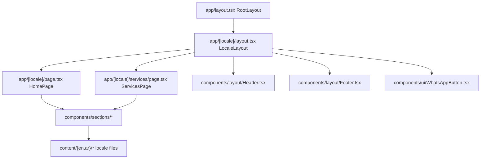

# Page Flow (Layouts -> Pages -> Sections)

This file describes how a request becomes UI.

## Composition diagram (homepage example)

## Key data flow rule

UI sections/components usually accept a `locale` prop and select data from `content/{locale}/...`.

For example:

- `app/[locale]/page.tsx` composes homepage sections.
- Each section (e.g. [`components/sections/HeroSection.tsx`](../components/sections/HeroSection.tsx)) loads locale content from `content/en/...` or `content/ar/...`.

